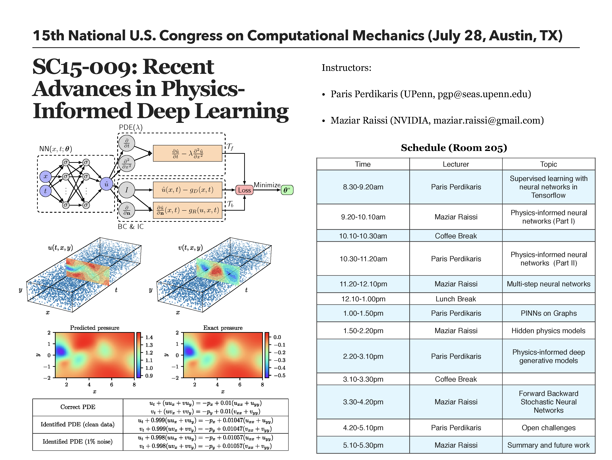

# USNCCM15 Short Course: Recent-Advances-in-Physics-Informed-Deep-Learning

### Instructors:
- Dr. Paris Perdikaris (University of Pennsylvania)
- Dr. Maziar Raissi (NVIDIA)

### Overview:

Advances in machine learning are continuously penetrating computational science and engineering. In this course we plan to review recent advances in deep learning with a particular focus on the development of data-driven algorithms for model discovery, forecasting, and uncertainty quantification in physical and engineering systems.

In this course we will (i) present a comprehensive review of state-of-the-art deep learning tools including feed-forward/convolutional/recurrent neural networks, variational auto-encoders, and generative adversarial networks, (ii) show how these data-driven models can be constrained to encode physical priors and domain knowledge, (iii) demonstrate how they can help us distill "hidden physics" from raw data and construct scalable and predictive surrogate models, (iv) provide a collection of diverse applications in computational science, including both forward and inverse problems in the presence of uncertainty.

Our goals for this course are threefold: (i) cover fundamental methodological and algorithmic concepts, (ii) showcase a collection of practical applications, and (iii) design a series of hands-on tutorials that will illustrate key practical and implementation aspects. Attendees will leave this course with a well-rounded understanding of the capabilities brought by deep learning in a wide range of applications in computational science and engineering. They will also sharpen their hands-on skills and familiarize themselves with how to adapt these tools to their respective application domains.

## Setting up your computing environment

To follow the hands-on tutorials, please make sure you have the following software properly installed and working on your computer:
- A Python 3 distrubution configured for scientific computing. The simplest way to set this up is by installing the [Anaconda](https://anaconda.org/anaconda/python) distribution.
- [Tensorflow](https://www.tensorflow.org/). If you have access to GPU hardware, make sure you install a version with GPU support.
- [Jupyter notebook](http://jupyter.org/). You will need this in order to follow some of the in-class tutorials.
- [Git](https://git-scm.com/downloads). You will need this in order to download and stay in sync with the latest code we will develop in class.

## A primer on Tensorflow

To best follow the hands-on tutorials, attendeed are expected to be familiar with basic concepts in Tensorflow programming (e.g., computational graphs, placeholders, automatic differentiation). New users are encouraged to study the tutorials presented [here](https://github.com/aymericdamien/TensorFlow-Examples).

